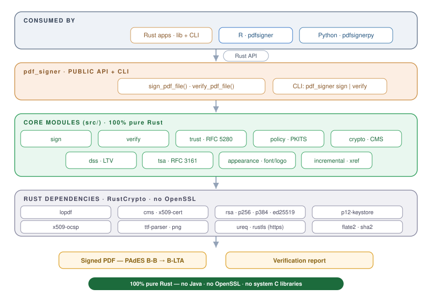

# pdf_signer

[](https://crates.io/crates/pdf_signer)
[](https://github.com/StrategicProjects/pdf_signer)
[](https://docs.rs/pdf_signer)
[](https://www.gnu.org/licenses/gpl-3.0)
[](https://www.rust-lang.org)
[](#pades-levels)

[](https://doi.org/10.5281/zenodo.21366481)

**Also available as:**
[](https://github.com/StrategicProjects/pdfsigner)
[](https://pypi.org/project/pdfsignerpy/)

A self-contained Rust library + CLI to **digitally sign** PDF documents with a
PKCS#12 keystore and **verify** their signatures — implementing the **PAdES**
baseline profiles (ETSI EN 319 142) from **B-B all the way to B-LTA**.

The cryptography is **100 % pure Rust** ([RustCrypto](https://github.com/RustCrypto)) —
no OpenSSL, no Java, no system C libraries — so the crate vendors cleanly (it
powers the [`signer`](https://github.com/StrategicProjects/signer) R package on
CRAN). TLS is the only optional, opt-in exception (for HTTPS timestamp/CRL
endpoints).

The signatures it produces are checked against **Poppler's `pdfsig`** and
`qpdf --check` during development (RSA/ECDSA; Adobe Reader does not validate
Ed25519 yet), and its own verifier is exercised offline by an in-process
RFC 3161 TSA in the test suite.

```console
$ cargo run --features testkit --example gen_assets   # writes sample.pdf + keystore.p12
$ pdf_signer sign sample.pdf signed.pdf keystore.p12 \
      --password password --reason "Approved" --level blta \
      --tsa-url http://timestamp.digicert.com \
      --text "Digitally signed" --image logo.png --font Arial.ttf
$ pdf_signer verify signed.pdf --roots icp-brasil-roots.pem
signature #1:
  valid:                 true
  signer:                CN=...
  chain_trusted:         true
  covers_whole_document: false
  detail:                valid CMS signature; signer: ...; chain: ... [trusted timestamp]
document timestamp #2:
  valid:                 true
  signer:                CN=DigiCert Timestamp ...
  chain_trusted:         true
  covers_whole_document: true
  detail:                valid document timestamp (RFC 3161); TSA chain: ...
document_intact:         true
$ pdfsig signed.pdf
  - Signature Type: ETSI.CAdES.detached
  - Signature Validation: Signature is Valid.
```

Run `pdf_signer sign --help` / `verify --help` for all options.

## Features

- **PAdES B-B → B-LTA** detached CMS signatures (`ETSI.CAdES.detached`).
- **Visible or invisible** signatures — a bordered text box (the signing
  statement + validation link) at any position on any page, with word wrap,
  an optional **embedded TrueType font** and a **PNG/JPEG logo**.
- **True incremental updates** — the original bytes are never rewritten, so
  **multiple signatures** compose and earlier ones stay valid.
- **RFC 3161 timestamps** — signature timestamps (B-T) and document timestamps
  (B-LTA), from any TSA.
- **Long-term validation material** — a `/DSS` with the full certificate chain,
  CRLs **and OCSP responses** fetched from the certificates' distribution points
  / responders (B-LT).
- **Verification** — locates signatures by document **structure** (not raw byte
  scanning), re-derives the signed byte range, checks the CMS profile
  (`content-type`, `message-digest`, ESS `signing-certificate-v2` binding, one
  SignerInfo, declared algorithms) and the signer's signature, binds the
  `/ByteRange` to the `/Contents`, and reports each signature *and* document
  timestamp. **Document integrity** is judged as a whole: the report is only
  `all_valid`/`all_trusted` when nothing but a `/DSS` was appended after the
  last signature or document timestamp (the classic "incremental update after
  signing" attack is rejected). RFC 3161 **timestamp tokens are validated
  cryptographically** (TSTInfo, TSA signature, imprint binding, nonce) and
  their TSAs are chain-validated **as TSAs** (`id-kp-timeStamping` required).
- **Certificate-chain validation** against a trust store (e.g. the **ICP-Brasil**
  roots): path building with **backtracking** (cross-signing / multiple
  intermediates), per-link signature (RSA, ECDSA P-256/P-384, Ed25519), validity,
  `basicConstraints` / `pathLenConstraint` / `keyCertSign`, leaf `keyUsage`,
  **critical-extension processing** (unknown critical or malformed extensions
  fail the path), **authenticated CRL + OCSP** revocation (signature and scope
  checked; a revocation dated at or before the validation time counts even if
  the evidence was issued later, per RFC 3161 App. B), **name constraints**
  (§4.2.1.10), the full **policy engine** (`valid_policy_tree`, policy mapping)
  with an optional required-policy set, and a bounded path search (a hostile
  certificate pool cannot make verification run for hours). For PAdES-B-T and
  above the chain is judged at the **timestamp's `genTime`** (when the
  timestamp verifies and its TSA is trusted — at the current time, or at a
  later trusted archival timestamp for B-LTA), not at "now", so a signature
  stays valid after the certificate expires.
- **RSA, ECDSA and Ed25519** signing keys (RSA PKCS#1 v1.5 + SHA-256; ECDSA
  P-256/SHA-256 and P-384/SHA-384; Ed25519 per RFC 8419), detected automatically
  from the keystore.
- **Pure Rust**, with an optional `https` feature (rustls) for TLS endpoints.

### PAdES levels

| Level      | What it adds                                       | `pades_level` | Needs a TSA |
|------------|----------------------------------------------------|---------------|-------------|
| **B-B**    | `signing-certificate-v2` (CAdES baseline)          | `Bb`          | no          |
| **B-T**    | + RFC 3161 **signature timestamp**                 | `Bt`          | yes         |
| **B-LT**   | + `/DSS` (certificate chain + CRLs + OCSP), merged with any existing DSS | `Blt` | yes |
| **B-LTA**  | + `/DocTimeStamp` over the whole file              | `Blta`        | yes         |

## Command-line interface

The crate ships a `pdf_signer` binary with two subcommands. Install it (or run
it straight from a checkout):

```console
$ cargo install --path . --features cli      # puts `pdf_signer` on your PATH
# …or, without installing:
$ cargo run --release --features cli -- sign  …    # everything after `--` is forwarded
$ cargo run --release --features cli -- verify …
```

### `sign`

```console
$ pdf_signer sign <INPUT> <OUTPUT> <KEYSTORE> --password <PWD> [options]
```

| Argument / flag | Meaning |
| --- | --- |
| `<INPUT>` `<OUTPUT>` `<KEYSTORE>` | input PDF, signed output PDF, PKCS#12 `.p12`/`.pfx` |
| `-p, --password` | keystore password; prefer `KEY_PASSWORD` in the environment or `--password-file <FILE>` (`-` = stdin) so it stays out of the process list |
| `--level <bb\|bt\|blt\|blta>` | PAdES level (default `bb`); `bt`+ need `--tsa-url` |
| `--tsa-url <URL>` | RFC 3161 timestamp authority (`http://`, or `https://` with the `https` feature) |
| `--signature-capacity <BYTES>` | space reserved for the signature (default 30000; raise for long TSA chains) |
| `--reason` / `--name` / `--location` / `--contact-info` | signature dictionary metadata (UTF-8 is written as UTF-16 text strings) |
| `--text <STR>` | draw a **visible** signature box with this text |
| `--page --x --y --width --height --font-size` | box placement/size, in points |
| `--no-border` | omit the box border |
| `--font <FILE.ttf>` | embed a TrueType/OpenType font in the box |
| `--image <FILE.png\|jpg>` | draw a PNG/JPEG logo in the box |

```console
# Invisible PAdES-B-B signature, password from the environment:
$ KEY_PASSWORD=secret pdf_signer sign in.pdf out.pdf keystore.p12

# Visible box, long-term (B-LTA) with a timestamp and an embedded logo:
$ pdf_signer sign in.pdf out.pdf keystore.p12 \
      --password secret --level blta \
      --tsa-url http://timestamp.digicert.com \
      --reason "Approved" --name "André Leite" \
      --text "Digitally signed" --image logo.png --font Arial.ttf
```

### `verify`

```console
$ pdf_signer verify <INPUT> [--roots <ROOTS.pem>]
```

Without `--roots` it reports cryptographic validity only; pass a PEM bundle of
trusted roots (e.g. ICP-Brasil) to additionally validate each signer's chain.

```console
$ pdf_signer verify out.pdf --roots icp-brasil-roots.pem
signature #1:
  valid:                 true
  signer:                CN=…
  chain_trusted:         true
  covers_whole_document: true
  detail:                valid CMS signature; signer: …; chain: chains to trusted root (…) [no trusted timestamp (…); at now]
document_intact:         true
```

The process exits `0` only when at least one signature is present, every
signature and document timestamp is valid, the document is intact (nothing but
a `/DSS` was appended after the last one) and — with `--roots` — every signer
and TSA chains to a supplied root. Run `pdf_signer sign --help` /
`verify --help` for the full, authoritative list of options.

## Library usage

```rust
use pdf_signer::{sign_pdf_file, verify_pdf_file_with_roots, Appearance, PadesLevel, SignOptions, TrustStore};

// Sign at PAdES-B-LTA with a visible appearance and a timestamp.
sign_pdf_file("in.pdf", "out.pdf", "keystore.p12", "password", &SignOptions {
    reason: Some("Approved".into()),
    pades_level: PadesLevel::Blta,
    tsa_url: Some("http://timestamp.digicert.com".into()),
    appearance: Some(Appearance {
        page: 1, x: 36.0, y: 36.0, width: 320.0, height: 64.0,
        font_size: 8.0, border: true,
        text: "Digitally signed.\nValidate at: example.org/validate".into(),
        ..Appearance::default()
    }),
    ..Default::default()
})?;

// Verify and validate the signer chain against trusted roots.
let roots = TrustStore::from_pem(&std::fs::read("icp-brasil-roots.pem")?)?;
let report = verify_pdf_file_with_roots("out.pdf", &roots)?;
for s in &report.signatures {
    println!("valid={} trusted={:?} — {}", s.valid, s.chain_trusted, s.detail);
}
// The one-line verdict: every entry valid + trusted, and nothing changed after
// the last signature (apart from a /DSS).
assert!(report.all_trusted() && report.document_intact);
```

The `https` feature enables TLS TSA/CRL endpoints:

```toml
pdf_signer = { version = "0.3", features = ["https"] }
```

The `testkit` feature exposes the fixture builders used by the tests (sample
PDFs, self-signed / CA-issued PKCS#12 keystores, an in-process RFC 3161 TSA).

## How it works



1. **PDF structure** (`lopdf`) — add an AcroForm signature field and a `/Sig`
   dictionary with `/SubFilter /ETSI.CAdES.detached`, a `/ByteRange` placeholder
   and a zero-filled `/Contents` placeholder.
2. **Incremental update** (`incremental.rs`) — keep the original bytes verbatim;
   append the new objects, a fresh xref table and a `/Prev`-chained trailer.
   Byte surgery (within the appended region) computes the real `/ByteRange` and
   patches it length-preservingly.
3. **CMS** (`cms` + `rsa` + `sha2`) — build a detached SignedData with the
   `contentType`, `messageDigest` and `signing-certificate-v2` signed
   attributes (the claimed time goes in the dictionary's `/M`, as PAdES
   baseline requires — no CMS `signing-time`); optionally fetch, verify and
   embed an RFC 3161 timestamp (nonce-bound).
4. **DSS / DocTimeStamp** (`dss.rs`) — collect the chain + CRLs into a `/DSS`,
   then append a document timestamp over the whole file.
5. **Verify** (`verify.rs` + `trust.rs`) — enumerate signatures from the parsed
   document structure, validate the CMS (and RFC 3161 timestamp tokens) and,
   optionally, the certificate path against a trust store.

## Scope & limitations

- **Path validation** implements RFC 5280 §6.1 broadly: signatures, validity,
  basic constraints, path length, key usage, CRL + OCSP revocation, name
  constraints, and the **policy engine** (`valid_policy_tree`, policy mapping,
  `requireExplicit­Policy`/`inhibitPolicyMapping`/`inhibitAnyPolicy`).
  The policy engine and name-constraint processing are validated against the
  **NIST PKITS** suite — **42/42 certificate-policy tests (§4.8–4.12)** and
  **38/38 name-constraint tests (§4.13)** pass. Run them with
  `PKITS_DIR=/path/to/pkits cargo test --test pkits -- --ignored` (the
  revocation/CRL-shape PKITS sections rely on features this crate does not
  claim, so they are not asserted).
- **Revocation is authenticated but soft-fail**: a CRL or OCSP response is only
  acted on once it is in scope, signed by the issuing CA / an authorized
  responder, and current; when no usable evidence is available a certificate is
  not treated as revoked. IDP / partitioned CRLs and a hard-fail mode are not
  yet implemented.
- **Signing keys**: RSA (SHA-256), ECDSA (P-256/P-384) and Ed25519. Most PDF
  readers (e.g. Adobe) do **not** validate Ed25519 PDF signatures yet — this
  crate's own verifier does.
- Incremental updates match the source: a **traditional xref table** *or* a
  **cross-reference stream** (auto-detected), chained via `/Prev`.
- Visible appearances can **embed a TrueType or CFF OpenType font** (a *simple*
  WinAnsi font — Latin-1, not Type0/Unicode, so non-Latin-1 glyphs become `?`;
  `.ttc` collections are rejected) and a **PNG or JPEG logo** (RGB, gray or
  CMYK); the default font is standard Helvetica. Line wrapping is approximate
  (character-count).
- **Refused inputs**: encrypted PDFs (even with an empty user password — the
  update would be written in clear) and documents certified with DocMDP `P=1`.
  Signing does not honour field locks or DocMDP `P=2/3` semantics beyond that.
- **Revocation evidence collection is best-effort**: an unreachable CRL
  distribution point or OCSP responder is skipped, so a B-LT signature made
  offline carries certificates only. Verification then soft-fails (no evidence
  ≠ revoked); a hard-fail mode is not yet implemented.
- **Long-term validation** relies on document timestamps: a signature
  timestamp's TSA is validated at the current time or at the `genTime` of a
  later *trusted* document timestamp (B-LTA). Without such an archival
  timestamp, a signature whose TSA certificate has expired is judged at "now".
- **RSASSA-PSS** signatures are not supported (reported as invalid, never
  silently accepted); `SubjectKeyIdentifier` signer identifiers likewise.

## Minimum Rust version

The crate's source and direct dependency requirements build with **rustc 1.81**
(September 2024), which keeps it usable from R/CRAN, where packages must build
with a toolchain about two years old. The committed `Cargo.lock` resolves
newer transitive releases for CI; on an old toolchain resolve MSRV-compatible
versions first:

```sh
CARGO_RESOLVER_INCOMPATIBLE_RUST_VERSIONS=fallback cargo update
cargo +1.81.0 check --all-features
```

Crates that raise their MSRV without declaring `rust-version` are the trap
(`p12-keystore` 0.2.x is edition 2024 and 0.2.1 uses let-chains), which is why
this crate pins `p12-keystore = "0.1.5"`.

## Roadmap

- [x] Pure-Rust CMS signing & verification (no OpenSSL/Java)
- [x] Visible appearance, incremental updates, multi-signature
- [x] PAdES B-B / B-T / B-LT / B-LTA (DSS + document timestamp)
- [x] Certificate-chain validation (RSA + ECDSA, CRL + OCSP, RFC 5280 subset)
- [x] Optional HTTPS (rustls) for TSA / CRL / OCSP
- [x] Whole-document integrity verdict, TSA purpose validation, DSS merging (v0.3.0)
- [x] [extendr](https://extendr.github.io/) bindings + vendoring for R / CRAN
- [x] ECDSA signing keys (P-256 / P-384)
- [x] RFC 5280 name constraints + required-policy check
- [x] Ed25519 signing keys; xref-stream incremental updates
- [x] RFC 5280 policy engine (valid_policy_tree, policy mapping) — **NIST PKITS
  validated** (42/42 policy + 38/38 name-constraint tests)
- [x] Richer visible appearances (embedded TrueType fonts + PNG/JPEG images)
- [x] Verification hardening — structural signature location, cryptographic
  RFC 3161 timestamp validation, authenticated CRL/OCSP, path-building
  backtracking, signing-time chain validation

## How to cite

If you use `pdf_signer` in academic work, please cite it via its
[Zenodo record](https://doi.org/10.5281/zenodo.21366481). The concept DOI
[10.5281/zenodo.21366481](https://doi.org/10.5281/zenodo.21366481) always resolves to the latest
release; each version also has its own DOI. GitHub's “Cite this repository”
reads [`CITATION.cff`](CITATION.cff) for BibTeX/APA.

```bibtex
@software{leite_pdf_signer,
  author    = {Leite, André and Vasconcelos, Hugo and Bezerra, Diogo and
               Wasiliew, Marcos and Amorim, Carlos},
  title     = {{pdf_signer: a pure-Rust engine to digitally sign and verify PDF documents (PAdES B-B → B-LTA)}},
  publisher = {Zenodo},
  doi       = {10.5281/zenodo.21366481},
  url       = {https://github.com/StrategicProjects/pdf_signer}
}
```

## License

GPL-3.0-or-later.
